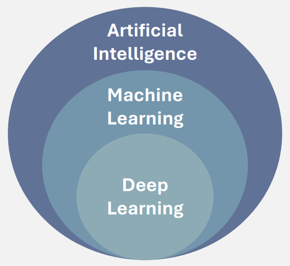

# Introduction to Artificial Intelligence and Machine Learrning 
{: .no_toc }

1. TOC
{:toc}

## What is Artificial Intelligence? 

**Artificial intelligence (AI)** involves simulating human intelligence in computers to perform tasks that typically require human cognitive functions like learning, reasoning, and problem-solving. 

**Machine learning** is a subset of AI and uses algorithms to learn patterns from data and make predictions without explicit programming. 

**Deep Learning** is a specialized form of machine learning that is used for very complex tasks. These models mimic the structure and reasoning of the human brain to process vast amounts of data and solve intricate problems such a image recognition, natural language processing, and speech recognition. Deep learning us especially useful when large amounts of data are available, and the problem is too complex for traditional machine learning methods. 

## Types of Data Used in AI
AI is data-driven and the way this data is organized and its type influences how AI models are developed and used. Understanding the differences between these data types is cruical for selecting the appropriate AI and machine learning methods.

### Structured vs Unstructured Data 
**Structured data** is data that is organized in a clear, predefined format or schema, usually in rows and columns. It is commonly stored in tables, spreadsheets, or relational databases. Structured data is often easy to analyze and process due to its well-defined structure.

**Examples of Structured Data**: 
* A customer database with fields for name, age, and address.
* A table of sales transactions with columns for product, price, and quantity.

**Unstructured Data** lacks a predefined format and is often more complex to process. It can consist of text, images, audio, video, or other forms of data without a fixed organization. Handling unstructured data typically requires advanced AI techniques like Natural Language Processing (NLP) for text or Computer Vision for images.

**Examples of Unstructured Data**:
* Social media posts, emails, and free-text documents.  
* Video files or audio recordings.  
* Images, photographs, and diagrams.  

### Labelled vs Unlabelled Data 
**Labelled data** is data that has been annotated with the correct answer or classification for each data point. This is commonly used in **supervised learning**, where a model is trained using the labelled data to learn the relationship between the inputs and the desired outputs. Often, labels are provided by humans or derived from predefined rules.

**Examples of Labelled Data**:
* A dataset of emails labelled as "spam" or "not spam".
* A set of medical images annotated with the type of disease or condition they depict.
* A collection of product reviews labelled as "one-star", "two-star", "three-star", "four-star", or "five-star".

**Unlabelled data** does not come with predefined labels or outcomes. This data is used in **unsupervised learning**, where the goal is to find hidden patterns, groupings, or structures within the data without relying on labeled outputs. While it can be more challenging to work with, unlabelled data is abundant and easy to collect. 

**Examples of Unlabeled Data**:
* A set of images without labels indicating what they contain.
* A series of audio recordings without any information about the content (e.g., a conversation, music, or noise).
* Raw logs of website user interactions, including clicks, scrolls, time spent on pages, and navigation paths, without any labels for intent (e.g., browsing vs. purchasing).

## Supervised Learning 
In **supervised learning**, the algorithm is trained on labeled data, meaning the input data comes with the correct output or label. The goal is to learn a mapping from input to output so that the model can make predictions on new, unseen data. 

There are 2 main types of supervised learning tasks: classification and regression. 

### Classification
In classification problems, the goal is to predict a category or class for a given input. The output is a discrete label (e.g., "hot" vs "cold", "low" vs "medium" vs "high"). 

**Examples**:
* Email spam detection, where the model predicts whether an email is "spam" or "not spam."
* Diagnosing diseases based on patient data, such as predicting whether a tumor is malignant or benign

### Regression
Regression is used when the output is a continuous value. The goal is to predict a continuous numeric value (e.g., a temperature or a price).

**Examples**:
* Predicting house prices based on features like square footage, location, and number of bedrooms.
* Forecasting sales figures based on historical data and economic indicators.  

 💡 A <strong>regression</strong> task involves predicting a continuous value, such as the temperature, while a <strong>classification</strong> task involves predicting a category, like whether the day will be "hot" or "cold". 
  

### Summary of Supervised Learning 
✅ Requires labeled data (data that includes both input features and their corresponding target values).  
✅ The model is trained on this labeled data to make predictions for unseen data.  
✅ The learning process is "supervised" because the model receives feedback on its predictions during training.

## Unsupervised Learning 
Unsupervised learning, on the other hand, works with **unlabeled data**, meaning there are no explicit target values or labels provided. The model tries to find patterns and structures in the data without any predefined outputs. The goal is to uncover hidden relationships, groupings, or structures in the data.

The two main types of unsupervised learning tasks are clustering and dimensionality reduction. 

### Clustering  
Clustering involves grouping data points into clusters or groups based on similarities between them. The model finds natural groupings in the data without prior knowledge of what those groups might be.

**Examples**: 
* Customer segmentation, where businesses group customers based on purchasing behavior to target different market segment. 
*  Identifying groups of similar images in a large collection, such as organizing photos by content (e.g., landscapes, portraits, or cityscapes).

### Dimensionality Reduction
Dimensionality reduction aims to reduce the number of input features while preserving the essential information. This can help visualize high-dimensional data and improve model performance by eliminating irrelevant features. 

**Examples**:
* Reducing the number of variables in gene expression datasets. 
* Compressing a large set of images to fewer features for easier storage or processing in image recognition tasks. 

### Summary of Unsupervised Learning 
✅ Works with unlabeled data (data with no target or label).  
✅ The model identifies patterns, structures, or groupings in the data.  
✅ Commonly used for exploratory data analysis, data preprocessing, or feature extraction.

## How We Approach Machine Learning Problems 
**🧩 Define the Problem**  
The first step is to clearly define the problem you want the machine learning model to solve. Understanding the task is critical, whether you're looking to predict a continuous value, classify data into categories, or identify patterns.  

**📊 Collect and Prepare Data**   
Once the problem is defined, the next step is to collect relevant data. This data could come from various sources like databases, sensors, experiments, or public datasets. Once it is gathered, it is imporant to clean,  process, and perform an exploratory analysis, before training an AI model. 

* **Data Cleaning**: Data cleaning is crucial to ensure that the dataset is accurate and ready for analysis. This involves:
    * **Removing or Correcting Invalid Entries**: Identifying and removing or correcting incorrect, duplicate, or irrelevant data entries that could interfere with the model’s learning process.
    * **Handling Missing Data**: Missing values in data can affect model performance, so it’s important to decide how to handle them (e.g., impute missing values, drop rows/columns, or use machine learning models to predict missing data).

* **Data Exploration**: Before cleaning, it’s important to explore the data to understand its structure and characteristics.   
    * **Basic Statistics**: Calculating measures like mean, median, standard deviation, etc., to summarize the dataset and identify any outliers or inconsistencies.  
    * **Grouping / Filtering**: Grouping data by categories or filtering for specific subsets of interest to focus on the most relevant aspects of the data.
    * **Visualizations**: Creating plots (e.g., histograms, scatter plots, box plots) to visually inspect distributions, relationships between features, and potential patterns.

* **Data Augmentation**: In some cases, you may need to increase the size and diversity of the data to improve model performance, particularly in tasks with imbalanced datasets. This can involve:  
    * **Increasing the Size of the Dataset**: Augmenting the data by creating synthetic samples or applying transformations (e.g., image rotations, noise addition) to increase the dataset size.

    * **Correcting for Imbalance**: If certain classes or categories are underrepresented in the data, balancing the dataset (e.g., oversampling underrepresented classes or undersampling overrepresented ones) can improve model fairness and performance.

**🤖 Choose a Model**  
After preparing the data, you need to select the right machine learning model for your problem. The choice of model depends on the problem type (e.g., regression, classification, clustering). For example, if you are predicting a continuous outcome, you might use linear regression, while if you are classifying images, a convolutional neural network (CNN) could be appropriate. It’s important to consider factors such as the complexity of the model and how interpretable it needs to be.

**✂️ Split the Data into Train and Test Sets**  
To evaluate your model's performance, it is essential to split the data into at least two parts: a training set and a test set. The training set is used to teach the model, while the test set is used to evaluate how well the model generalizes to new, unseen data. A common split is 80% for training and 20% for testing, though variations like 70/30 or 90/10 are also used.

**🔄 Train the Model**  
In this step, the model is trained on the training data. During training, the model learns patterns from the data, adjusting its internal parameters to minimize errors. The model makes predictions, compares them to actual values, and then adjusts based on the feedback it receives. This step may take time, depending on the size of the dataset and the complexity of the model.

**🛠️ Fine-Tune the Model** 
Once the initial model is trained, fine-tuning is necessary to improve its performance. This involves adjusting hyperparameters (e.g., learning rate, number of layers in a neural network) to optimize the model. Techniques such as grid search or random search can help find the best hyperparameters. Cross-validation is also used to ensure that the model is not overfitting and can generalize well to new data. 

**📈 Evalute Model Performance**  
After training and fine-tuning, the next step is to evaluate how well the model performs. This is done by using evaluation metrics that depend on the problem type. For classification tasks, metrics like accuracy, precision, recall, and F1-score are used. For regression, metrics such as Root Mean Squared Error (RMSE) or Mean Absolute Error (MAE) are common. Comparing these metrics with baseline models helps assess the model's effectiveness.

