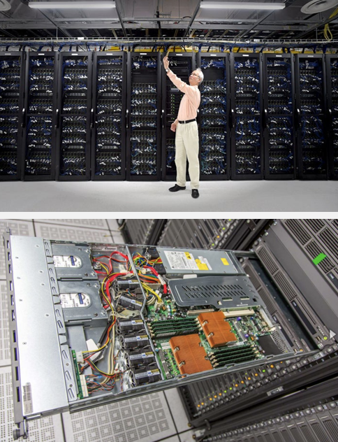

# ARC Clusters 
{: .no_toc }

1. TOC
{:toc}

## Services Available through ARC 

Canada’s Advanced Research Computing (ARC) resources feature six national HPC clusters and cloud services. The Alliance offers free computing power, cloud access, and data storage to researchers at Canadian institutions.

The images below showcase the Graham cluster and a close-up of one of its server drawers. These images are courtesy of the [Waterloo Record](https://www.therecord.com/news/waterloo-region/uw-supercomputer-getting-multi-million-dollar-upgrade/article_54d43b2e-de53-5d3a-aadc-f682ac487126.html). 

## HPC Clusters 
Researchers can access the following systems:   
🌿 **[Arbutus](https://docs.alliancecan.ca/wiki/Arbutus)**: University of Victoria   
🐳 **[Béluga](https://docs.alliancecan.ca/wiki/B%C3%A9luga/en)**: Montreal's École de technologie supérieure   
🌲 **[Cedar](https://docs.alliancecan.ca/wiki/Cedar)**: Simon Fraser University   
💧 **[Graham](https://docs.alliancecan.ca/wiki/Graham)**: University of Waterloo  
🦭 **[Narval](https://docs.alliancecan.ca/wiki/Narval/en)**:  Montreal's École de technologie supérieure  
🌊 **[Niagara](https://docs.alliancecan.ca/wiki/Niagara)**: University of Toronto 

Arbutus is a cloud-based platform that allows researchers to launch and customize virtual machines to suit their specific computing needs. 

Béluga, Cedar, Narval and Graham are general-purpose HPC clusters. They offer a mix of compute nodes, including high-memory nodes and GPU-accelerated options, and are suitable for a wide range of research applications. 

Niagara is a specialized cluster designed for large-scale parallel computing (more than 1000 jobs). 

 ⚠️ <strong>Important:</strong> Check the current status of ARC resources <a href="https://status.alliancecan.ca/" target="_blank">here</a>. 
  

### Ongoing Upgrades to ARC Resources 
The ARC system is undergoing major upgrades to enhance performance, capacity, and reliability. These improvements will provide faster processing, expanded storage, upgraded GPUs, and overall improved system stability.

#### Upgrade Timeline and Impact
* The upgrades are expected to be completed by spring 2025.
* During this transition, there may be occasional outages or temporary reductions in service.

#### What’s Changing?
The upgrades include the replacement of existing systems with newer, more powerful infrastructure:
* Béluga → [Rorqual](https://docs.alliancecan.ca/wiki/Rorqual/en)
* Cedar → [Fir](https://docs.alliancecan.ca/wiki/Fir)
* Niagara & Mist → [Trillium](https://docs.alliancecan.ca/wiki/Trillium)
* Graham → [Nibi](https://docs.alliancecan.ca/wiki/Nibi) 

Narval is also undergoing upgrades and will remain in commission. 

These new systems will support a wider range of research needs, offering faster processing speeds, greater storage capacity, and upgraded GPUs to handle complex computations more efficiently.

#### Old and New Cluster Names 
As part of the ARC infrastructure upgrades, several HPC clusters are being retired and replaced with new systems. Each system's name is carefully chosen to reflect Canada's natural environment, Indigenous heritage, and scientific contributions.

**Narval** is named after the narwhal, a whale species occasionally seen in the Gulf of St. Lawrence.

| **Old System**      | **New System** | **Name Meaning and Significance** |
|---------------------|--------------|---------------------------|
| **Béluga**         | **Rorqual** | **Béluga** was named after the beluga whale population in the St. Lawrence River. **Rorqual**, meaning "whale" in French, continues the marine theme. |
| **Cedar**          | **Fir**      | **Cedar** was named after the Western Red Cedar, British Columbia’s official tree, which holds deep cultural and spiritual significance for the region's First Nations peoples. |
| **Niagara & Mist** | **Trillium** | **Niagara & Mist** referenced Niagara Falls. **Trillium** is named after Ontario’s provincial flower and represents resilience and natural beauty. |
| **Graham**         | **Nibi**     | **Graham** honoured Wes Graham, the first director of the Computing Centre at the University of Waterloo. **Nibi**, meaning "water" in Anishinaabemowin, was chosen to reflect the cluster's use of liquid cooling. |

These new names reflect the evolution of Canada's ARC infrastructure and maintain connections to the country’s natural beauty, Indigenous culture, and scientific legacy.

## Cloud Computing  
Cloud services offer researchers customizable virtual machines that enable them to:   
✅ Build portals and platforms  
✅ Store and analyze data  
✅ Collaborate with colleagues 

## Storage Locations 
The Alliance provides high-speed temporary and long-term data storage options. As a shared resource, users are expected to manage storage responsibly.

🏠 `\HOME`: The home directory is best for storing source code, small parameter files, and job submission scripts. It has a smaller quota and isn't optimized for reading or writing large files, so it's not ideal for heavy data operations.

📁 `\PROJECT`: The project space is designed for sharing data within a research group. It offers a larger quota and is linked to a PI's account. It is suitable for storing relatively static data that doesn't change frequently. Avoid using project space for data that needs frequent updates or changes, as it can overload the backup system.

🧹 `\SCRATCH`: Scratch space is perfect for intensive read/write operations on large files (>100 MB). It is meant for temporary files, such as checkpoint files and job outputs. Important data should not be stored here, as it is not backed up, and older files are subject to purging. `\SCRATCH` is intended for files that can easily be recreated.

| **Storage Type** | **Best For**                             | **Quota**                       | **Performance**                      | **Backup**                 | **Data Retention**         |
|------------------|------------------------------------------|---------------------------------|--------------------------------------|----------------------------|----------------------------|
| **Home**      | Source code, small files, job scripts   | Smaller quota                   | Not optimized for large files        | Limited backup             | Persistent                  |
| **Project**   | Sharing data within research groups     | Larger quota                    | Optimized for data sharing           | Backed up periodically      | Static, less frequent changes|
| **Scratch**   | Temporary files, large read/write tasks | Large, temporary quota          | High performance for large files     | Not backed up               | Purged over time            |

### Default Storage Quotas 

To ensure there’s enough space for everyone, there are quotas and policies in place for backups and managing the filesystem. Users get access to `/HOME` and `/SCRATCH` spaces, and each group is allocated 1 TB of project space.

| Cluster    | Home Space                          | Scratch Space                     | Project Space                       | Nearline Space                       |
|------------|-------------------------------------|-----------------------------------|-------------------------------------|--------------------------------------|
| **Cedar**🌲 | 50 GB & 500K files per user         | 20 TB & 1M files per user         | 1 TB & 500K files per group         | 2 TB & 5000 files per group          |
| **Graham** 💧 | 50 GB & 500K files per user         | 20 TB & 1M files per user         | 1 TB & 500K files per group         | 2 TB & 5000 files per group          |
| **Béluga** 🐳 | 50 GB & 500K files per user         | 20 TB & 1M files per user         | 1 TB & 500K files per group         | 1 TB & 500K files per group          |
| **Narval** 🦭 | 50 GB & 500K files per user         | 20 TB & 1M files per user         | 1 TB & 500K files per group         | 1 TB & 500K files per group          |
| **Niagara** 🌊| 100 GB per user                     | Up to 25 TB per user (group-based allocation) | By group allocation (RRG or RPP)    | 10 TB per user                       |

### Exanding Storage
If additional storage is required, users can request small increases through the **Rapid Access Service**, while larger allocations are available via the **Resource Allocation Competitions**.

For more information on policies, quotas, and how to request more storage, visit the links below: 
* [Policies and Quotas](https://docs.alliancecan.ca/wiki/Storage_and_file_management#Storage_types)
* [Using `nearline`](https://docs.alliancecan.ca/wiki/Using_nearline_storage)
* [Rapid Access Service](https://alliancecan.ca/en/services/advanced-research-computing/accessing-resources/rapid-access-service)
* [Resource Allocation Competitions](https://alliancecan.ca/en/services/advanced-research-computing/accessing-resources/resource-allocation-competition)
