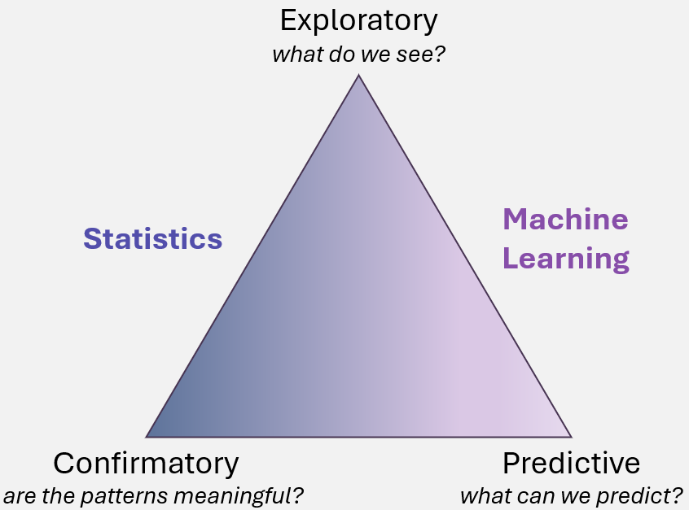

# Introduction to Data Science
{: .no_toc }

1. TOC
{:toc}

## What is Data Science? 
Welcome to the world of data science, where raw data transforms into meaningful insights and drive progress. Whether you're new to data science or looking to expand your skills, this guide is designed to introduce you to core concepts, tools, and techniques to help you with your research.  

At its core, data science combines statistics, computer science, and domain knowledge to extract meaning from data.  It involves transforming raw data into valuable knowledge by applying various techniques to uncover patterns, make predictions, and validate assumptions. Data science can be broken down into three main types of analysis: **exploratory**, **confirmatory**, and **predictive**. Each type plays a crucial role in the data science process, helping researchers and analysts make informed decisions, test hypotheses, and forecast future trends.

### Exploratory Data Science: Understanding Data 
The first step in data science is to **explore** the data. This stage is focused on understanding the structure of the data, identifying trends, and discovering patterns that may not be immediately obvious. Exploratory data analysis (EDA) helps researchers uncover hidden insights, understand distributions, and detect outliers.

In the exploratory phase, data scientists often use visualization techniques, such as histograms, scatter plots, and heatmaps, to visually represent the data and identify relationships between variables. These techniques help in recognizing underlying trends that can inform further analysis.

#### Examples of Exploratory Analysis:
* **Genetics**: Identifying correlations between genetic mutations and diseases. By examining genetic data, researchers can uncover patterns that suggest how specific mutations may be linked to various health conditions, such as cancer or diabetes.

* **Astronomy**: Analyzing trends in the composition of exoplanet atmospheres. This involves looking at data from telescopes and space probes to identify commonalities in the chemical makeup of planets beyond our solar system and helps astronomers better understand planetary formation and habitability.

Exploratory data science helps build a foundational understanding of the data and allows researchers to ask the right questions and form hypotheses for further analysis.

### Confirmatory Data Science: Testing Hypotheses and Validating Assumptions 
Once the data has been explored, the next step is **confirmatory** analysis. This phase involves testing hypotheses or validating assumptions formed during the exploratory phase. Data scientists use statistical tests and models to confirm whether the patterns observed in the data hold true and are statistically significant. This allows them to draw reliable conclusions that can be used for decision-making or further research.

Confirmatory data science involves the use of inferential statistics, such as t-tests, chi-square tests, and regression analysis, to test relationships between variables. The goal is to validate whether there is evidence to support specific hypotheses or assumptions.

#### Examples of Confirmatory Analysis:
* **Ecology**: Studying the associations between rainfall patterns and bird migration. Researchers may hypothesize that birds migrate differently in response to seasonal rainfall patterns. By analyzing data on bird migration and rainfall, they can confirm or refute this hypothesis, and better understand how climate affects wildlife behavior.  

* **Economics**: Testing whether economic indicators can predict stock market trends. A data scientist might hypothesize that certain economic indicators, such as unemployment rates or inflation, have a direct relationship with stock market performance. Statistical models can be applied to test these hypotheses and validate whether these economic factors can reliably predict market changes.  

Confirmatory analysis helps strengthen or challenge existing assumptions and can add credibility to insights derived from the data.

### Predictive Data Science: Forecasting the Future
One of the most powerful aspects of data science is **predictive** analysis. This type of analysis focuses on making predictions about future events based on current or historical data. Predictive modeling uses statistical techniques and machine learning algorithms to forecast outcomes, offering valuable insights into what may happen under different conditions.

Data scientists develop predictive models that use patterns identified in historical data to make forecasts about future events. These models can help organizations and researchers make data-driven decisions about how to allocate resources, manage risks, and plan for the future.

#### Examples of Predictive Analysis
* **Healthcare**: Predicting the likelihood of disease based on health data. Using data from medical records, lifestyle factors, and genetic information, predictive models can forecast the probability of individuals developing certain conditions, such as heart disease, diabetes, or cancer. This can enable early intervention and personalized treatment plans. 

* **Meteorology**: Predicting future storm patterns. By analyzing weather data over time, data scientists can develop models to forecast storms, hurricanes, and other weather events. This can help governments and organizations better prepare and respond to natural disasters.

Predictive data science not only helps in anticipating future events but also allows for proactive decision-making and resource planning.

## Types of Data Used in AI
AI is data-driven and the way this data is organized and its type influences how AI models are developed and used. Understanding the differences between these data types is cruical for selecting the appropriate AI and machine learning methods.

### Structured vs Unstructured Data 
**Structured data** is data that is organized in a clear, predefined format or schema, usually in rows and columns. It is commonly stored in tables, spreadsheets, or relational databases. Structured data is often easy to analyze and process due to its well-defined structure.

Examples of Structured Data: 
* A customer database with fields for name, age, and address.
* A table of sales transactions with columns for product, price, and quantity.

**Unstructured Data** lacks a predefined format and is often more complex to process. It can consist of text, images, audio, video, or other forms of data without a fixed organization. Handling unstructured data typically requires advanced AI techniques like Natural Language Processing (NLP) for text or Computer Vision for images.

Examples of Unstructured Data:
* Social media posts, emails, and free-text documents.  
* Video files or audio recordings.  
* Images, photographs, and diagrams.  

### Labelled vs Unlabelled Data 
**Labelled data** is data that has been annotated with the correct answer or classification for each data point. This is commonly used in **supervised learning**, where a model is trained using the labelled data to learn the relationship between the inputs and the desired outputs. Often, labels are provided by humans or derived from predefined rules.

Examples of Labelled Data:
* A dataset of emails labelled as "spam" or "not spam".
* A set of medical images annotated with the type of disease or condition they depict.
* A collection of product reviews labelled as "one-star", "two-star", "three-star", "four-star", or "five-star".

**Unlabelled data** does not come with predefined labels or outcomes. This data is used in **unsupervised learning**, where the goal is to find hidden patterns, groupings, or structures within the data without relying on labeled outputs. While it can be more challenging to work with, unlabelled data is abundant and easy to collect. 

Examples of Unlabeled Data:
* A set of images without labels indicating what they contain.
* A series of audio recordings without any information about the content (e.g., a conversation, music, or noise).
* Raw logs of website user interactions, including clicks, scrolls, time spent on pages, and navigation paths, without any labels for intent (e.g., browsing vs. purchasing).

## Getting Started with Data Science
💻 **Learn the Basics of Coding**: Familiarize yourself with programming languages like [Python](https://www.python.org/) or [R](https://www.r-project.org/), which are widely used in data science. Understanding libraries like `pandas`, `numpy`, and `matplotlib` can help with data manipulation and visualization.

📊 **Understand Statistics**: Strong statistical knowledge is the backbone of data science. Learn key concepts like probability, hypothesis testing, and distributions to draw meaningful conclusions from data.

🤖 **Explore Machine Learning**: Once you understand the basics, dive into machine learning techniques. Tools like `scikit-learn`, `PyTorch`, or `TensorFlow` (for Python) and `caret` (for R) make it easier to implement algorithms and evaluate models.

🛠️ **Practice with Projects**: Hands-on experience is key. Start small with datasets from websites like [Kaggle](https://www.kaggle.com/) or [UCI Machine Learning Repository](https://archive.ics.uci.edu/) to build and refine your skills.

🔍 **Stay Curious and Keep Learning**: Data science is constantly evolving. Stay updated with the latest tools and technologies by engaging with the community, reading research papers, and attending workshops or online courses.
