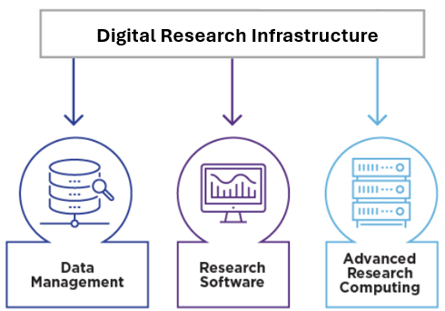

# What is Digital Research Infrastructure (DRI)? 

## Overview 
The Digital Research Alliance of Canada (the Alliance) empowers researchers at Canadian institutions, with the ultimate goal of positioning Canada as a leader in the global knowledge economy. 

By funding and advancing Canada's **Digital Research Infrastructure** (DRI), the Alliance provides a centralized and streamlined platform for the Canadian research community. 

Canada's DRI integrates **advanced research computing** (ARC), **research data management** (RDM), and **research software** (RS), and enables impactful research at scale. The DRI ecosystem ensures that Canadian researchers have access to the infrastructure and support they need to advance their work and contribute to innovation, regardless of their discipline or geographical location.

---

### Advanced Research Computing 

Advanced Research Computing (ARC) is a cornerstone of Canada's digital research infrastructure and supports innovation across public and private sectors. It encompasses the tools and technologies reuqires for conducting computational- and data-intenstive research. 

ARC integrates cloud computing, high-speed networks, and robust cybersecurity measures that enable researchers to tackle complex challenges. More than 200 experts at 38 partner insitutions acorss Canada provide essential expertise and keep ARC accesible to everyone.  

ARC enables research across a variety of fields, such as: 
* **Health Sciences**: advancing disease treatments and discovery 
* **Astronomy**: exploring distant planets 
* **Ecology**: studying weather patterns  
* **Engineering and AI**: creating models to study protein-drug interactions  
 
<!-- Include links to sub-pages -->
--- 

### Research Data Management 

---

### Research Software 

--- 

