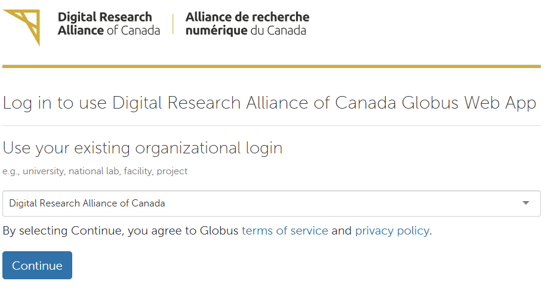
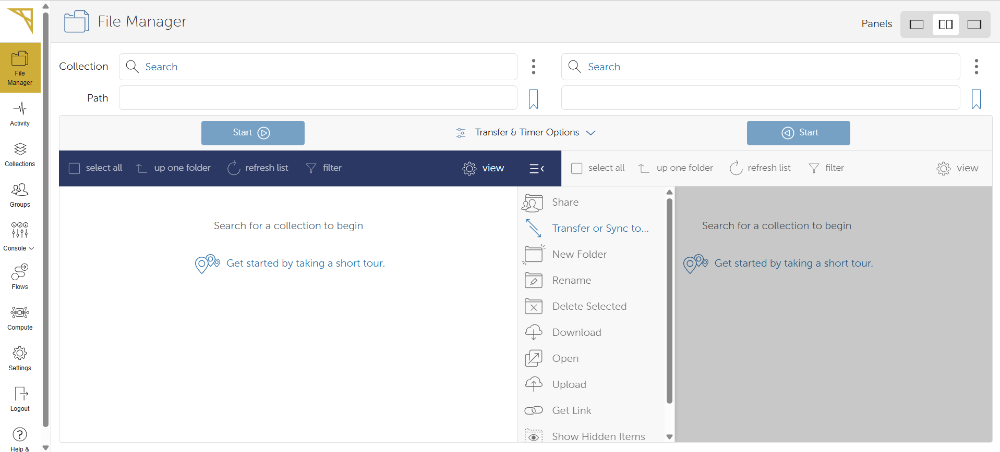
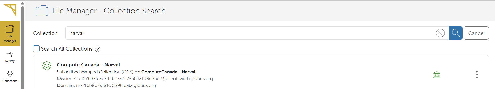
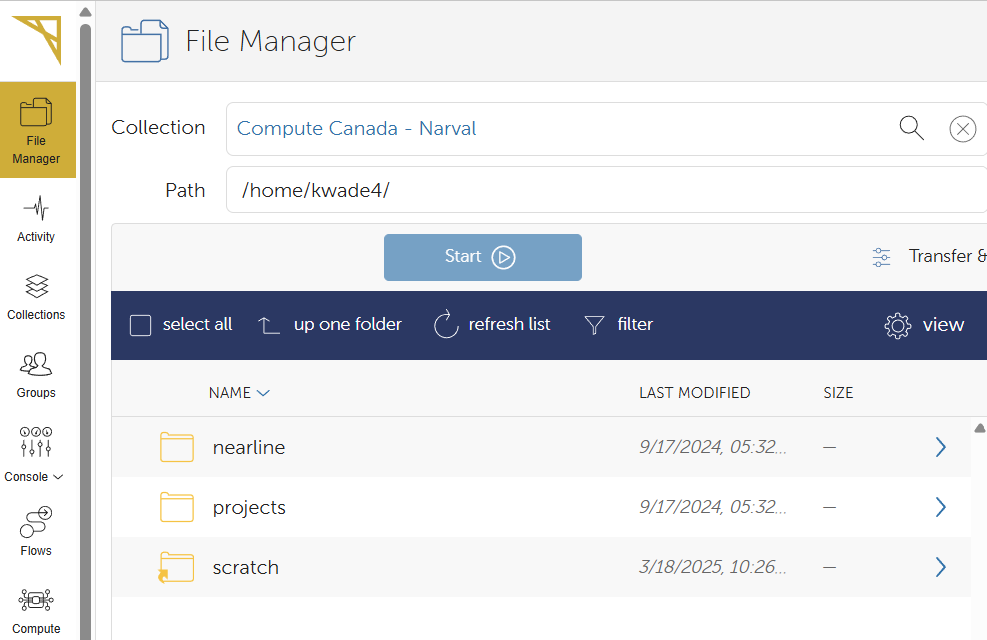
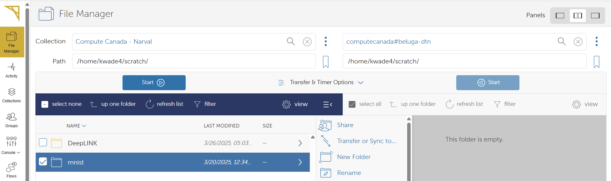
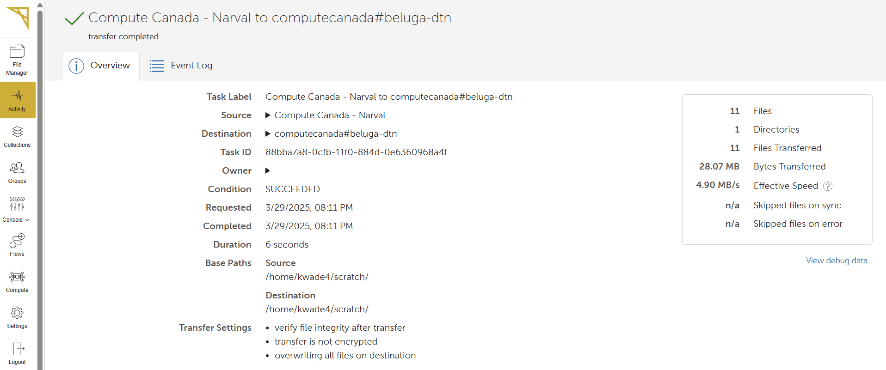
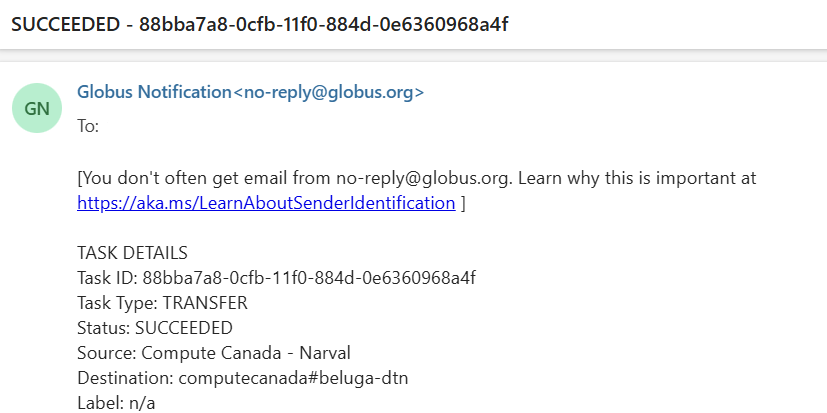
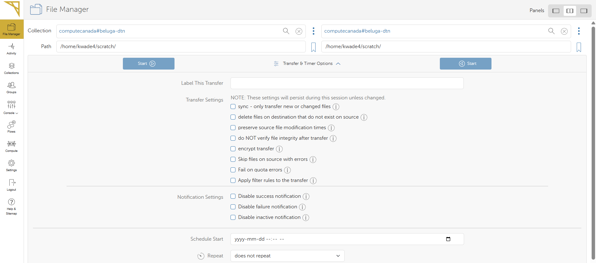

# Getting Started with ARC 
{: .no_toc }

1. TOC
{:toc}

## Connecting to an ARC cluster 
ARC systems are remote, meaning you must connect to them from your local machine. This is typically done using a secure shell (`SSH`) connection.

Before connecting, ensure you have:

* A terminal or SSH client installed (e.g., Terminal on macOS/Linux, PuTTY on Windows)  
* Your CCDB system username and password 

### Step-by-step Connection Guide 

1. **Open Your Terminal**: On macOS or Linux, open the `Terminal`. On Windows, use `Command Prompt`, `PowerShell`, or an SSH client like `PuTTY`.
2. **Connect to the ARC cluster**: To connect to the `Cedar` supercomputer, type the following command:  

    ```console
    ssh USERNAME@cedar.alliancecan.ca
    ```

    * Replace `USERNAME` with your CCDB username. 
    * To log into another ARC cluster, replace `cedar` with its name (`narval`, `beluga`, etc.)

3. **Enter your password**: If you are not using `SSH` key authentication, you will be prompted to enter your password. 

4. **Authenticate using MFA**: Follow the multi-factor authentication prompt (e.g.: approve the request on Duo).   


<div style="background-color: #eaf3ea; border-left: 5px solid #8FBC8F; padding: 10px; color: black;">
  ⚠️ <strong>Important:</strong> Once you are logged in, you will be in the <code>HOME</code> directory. 
</div>  
    
Learn more about [ARC storage locations](). 


#### Trouble Shooting 
* If the `SSH` connection fails, ensure your internet connection is stable.
* Verify that your username and password are correct.
* If using `SSH keys`, confirm they are correctly configured.

## Transferring Data 
Tranferring data between your local computer and remote clusters is an important part of working with HPC systems. The method you choose depends on the size of the data, the systems involved, and the specific requirements of your project. 

Login nodes have internet access, so commands such as `curl` or `wget` can be used to download files directly from the internet. The `scp` command is ideal for simple transfers between your personal computer and remote ARC clusters. For larger datasets or transfers between two ARC clusters, Globus provides high-speed, secure transfers, making it the best option for large-scale file transfers.

### Using Command Line Tools (`scp`)
  
The `scp` command is used to securely copy files or directories between a local (your personal computer) and a remote (HPC cluster) host, or between two remote hosts. It uses `SSH` for data transfer and provides a secure way to transfer files over the network.

`scp <source> <destination>`  

**Copying a file from local to remote**  
```bash 
scp myfile.txt user@remote_host:/path/to/remote/directory/
```
  
* `myfile.txt`: The file you want to transfer from your local system.  
* `user@remote_host`: Replace `user` with your username on the remote system, and `remote_host` with the remote server's address (it could be an IP address or domain name).
* `/path/to/remote/directory/`: The directory on the remote server where the file will be placed.  

**Copying a file from remote to local**
```bash
scp user@remote_host:/path/to/remote/file.txt /path/to/local/directory/
```

**Copying a directory from local to remote**
```bash
scp -r my_directory/ user@remote_host:/path/to/remote/directory/
```  
  
The `-r` flag (stands for recursive) tells `scp` to copy the entire directory and all its contents.  


### Using Globus 
Globus is a fast, reliable, and user-friendly tool for secure file transfers. It allows you to easily move files between **your personal computer and an ARC cluster** or between **two ARC clusters**.

In Globus, a **collection** is a designated storage location that allows you to transfer and manage files. Collections can be hosted on HPC clusters, cloud storage systems, or personal computers, and provide a seamless way to move data across different systems.

<div style="background-color: #eaf3ea; border-left: 5px solid #8FBC8F; padding: 10px; color: black;">
  ⚠️ <strong>Important:</strong> To transfer files between your personal computer and ARC clusters using Globus, you must install and run 
  <a href="https://www.globus.org/globus-connect-personal" target="_blank" style="color: #006400; font-weight: bold;">Globus Connect Personal</a>. 
  This allows your computer to act as a Globus collection for secure data transfers.
</div>

#### Logging Into Globus 

1. Go to the Alliance's [Globus Portal](https://globus.alliancecan.ca/). 

    In the **Use your existing organizational login** box, select **Digital Research Alliance of Canada**. 

    

    Press **Continue**.

2. Log in using your **CCDB** username (not your email) and password. 

3. Open **File Manager** in the Globus portal. 
    
    


#### Transferring Files 
1. Use the **Search** bar to find collections by name. 

    For example to transfer files to or from **Narval**, type `narval` and select the `Compute Canada - Narval` option. 
    

2. Once the collection is selected, you will see a ist of directories and files. Navigate them by **double-clicking the folder** or using the **up one folder** button. 
        

3. To start a transfer, select a file or directory by single-clicking. To select multiple files or directories, hold `Ctrl`. 

4. Press the **blue Start button** to start the transfer. 
        

5. Globus will assign a unique job ID, and the transfer will begin immediately. 

6. To track the progress of your file transfer or view past transfers, click on **Activity** in the left sidebar. 
        

    Once your transfer is complete, you will receive an email. 
        

#### File Transfer Options 

Globus also offers a variety of file transfer options through the **Transfer & Sync Options** button. These allow you to:  
✅ **Sync transfers** (only move new or modified files)    
✅ **Delete destination files** that don’t exist in the source  
✅ **Preserve file modification timestamps**  
✅ **Verify file integrity** after transfer (enabled by default)  
✅ **Encrypt the transfer** (note: encryption is slow and should only be used only for sensitive)   

  

For more details on using Globus, refer to the Alliance's [Globus Documentation](https://docs.alliancecan.ca/wiki/Globus) page. 


## Using Python 

When working with Python on ARC clusters, it's best to set up a **virtual environment (`venv`)**. This helps keep your Python code runs with the correct dependencies, no matter which compute node processes your job. 

ARC clusters use **wheels** which are pre-compiled Python packages that are optimized or the clusters and help to speed up installation and reduce disk usage. 

### Setting Up a Python Virtual Environment 

1. Check which versions of Python are available. 
    ```bash
    module avail python 
    ```

2. Load the desired Python version. 
    ```bash
    module load python/3.10 
    ```

3. Create a virtual environment. 
    ```bash
    virtualenv --no-download ENV 
    ```
    This command creates a new virtual environment called `ENV`. The `--no-download` flag ensures that the **wheels** optimized for the ARC clusters are used. 

4. Activate the virtual environment. 
    ```bash
    source ENV/bin/activate
    ```

5. Upgrade `pip`. 
    ```bash
    pip install --no-index --upgrade pip
    ```
    This command updates pip to the latest version and the `--no-index` flag ensures that the ARC-optimized wheels are used. 

6. Exit the virtual environment. 
    ```bash
    deactivate
    ```

<div style="background-color: #eaf3ea; border-left: 5px solid #8FBC8F; padding: 10px; color: black;">
  ⚠️ <strong>Important:</strong> While it can be a great option for managing packages on your local computer, <strong>do not use Anaconda</strong> on ARC clusters. 
</div>

### Installing Python Packages 

To install Python packages in your virtual environment, the best approach is to use wheels, which are optimized for the ARC clusters. This makes the installation process much faster and more efficient.

#### Recommended Method
Install packages using `pip` within your job script.  
     
```console
pip install --no-index <package_name>
```
The `--no-index` flag ensures that `pip` uses wheels, which are pre-compiled and tailored for ARC systems. This makes installation faster and helps conserve disk space in your `/HOME` directory.

#### Alternative Methods
If wheels are not provided for your Python package, you can install packages from GitHub or use the centralized web-based version of `pip` on the login node. 

<div style="background-color: #eaf3ea; border-left: 5px solid #8FBC8F; padding: 10px; color: black;">
  ⚠️ <strong>Important:</strong> Installing packages using GitHub or the web-based `pip` version is not ideal for frequent or large installations. 
</div>

When using these alternative installation methods, in your job script, you need to create and activate your virtual environment in your `\HOME` directory:    

```console 
source $HOME/ENV/bin/activate
```

### Pre-installed Packages 
ARC clusters come with a variety of pre-built Python wheels that are optimized for the cluster’s architecture, allowing for fast and efficient installations. These include popular libraries commonly used in scientific computing, machine learning, and bioinformatics. Some of the pre-installed packages include:
* PyTorch 
* Biopython
* Scikit-learn (sklearn)
* Many more! 

For convenience, the `SciPy` stack is available as a module: 
* NumPy
* SciPy
* Matplotlib
* IPython 
* pandas
* Sympy 
* nose 

To load the `SciPy` stack, use: 
```console
module load scipy-stack
``` 

<div style="background-color: #eaf3ea; border-left: 5px solid #8FBC8F; padding: 10px; color: black;">
  💡 <strong>Important:</strong> In addition to Python, ARC clusters also support other programming languages, including R, C++, MATLAB, Java, etc.  
</div>

## Software Available 
ARC clusters also have a variety of scientific software pre-installed from various disciplines. Some examples include: 

| **Discipline**            | **Software**                                                                                              |
|-------------------------|----------------------------------------------------------------------------------------------------------|
| **🔬 Chemistry**         | RDKit, CP2K, LAMMPS, GROMACS, ABINIT, AMBER, Atomicrex                                                    |
| **🧬 Bioinformatics**    | Plink, REGENIE, Rosetta, IQ-Tree, Bowtie-2, Samtools, MUSCLE                                             |
| **⚙️ Physics / Engineering** | Quantum ESPRESSO, Abaqus, OpenFOAM, MESA, STAR-CCM                                                   |
| **🌍 Earth Sciences**    | CCSM, CDO, GRASS GIS, PROJ, QGIS                                                                          |

For a complete list of available software, visit the [Alliance's Documentation](https://docs.alliancecan.ca/wiki/Available_software).