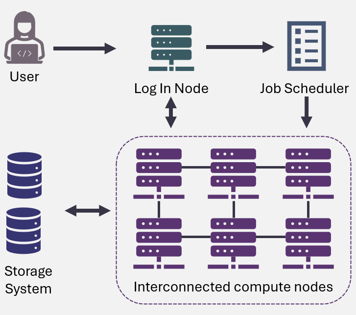

1. TOC
{:toc}

# Introduction to High-Performance Computing
{: .no_toc .text-delta }

## What is HPC and How is it Different from a Personal Computer? 
In many fields, computing power is a limting factor for research progress. For problems that demand substantial processing power, traditional personal computers simply aren’t equipped to handle the load. This is where High-Performance Computing (HPC) comes into play. 

HPC refers to the use of specialized computing systems, often referred to as **supercomputers** or **compute clusters**, that work together to process and analyze data at incredibly fast speeds. These systems consist of hundreds, thousands, or even millions of processors working in parallel to perform complex calculations far more efficiently than typical desktop machines.

While personal computers are built for everyday tasks, HPC systems are optimized for large-scale computations, simulations, and data-intensive operations. From simulating molecular interactions and training deep learning models to analyzing vast scientific datasets, HPC provides the computational power necessary to solve problems that would take days, months, or even years on a single machine.

## Structure of an HPC System 

An HPC system typically involves multiple **nodes** connected together to form a cluster, with each node containing several processors and large amounts of memory. These nodes work together to run parallel jobs, enabling researchers to tackle computation-intensive problems such as simulating weather patterns, analyzing large datasets, or training deep learning models.

The main types of nodes in an HPC system include:

* **Compute Nodes**: The primary workers, responsible for handling computational tasks.
* **Login Nodes**: Allow users to access the system, submit jobs, and manage files. Heavy computations are not run on login nodes; instead, jobs are submitted to the compute nodes for processing.
* **Storage Nodes**: Manage data storage and provide access to shared file systems, ensuring efficient data management across the cluster.
* **Head Nodes**: A specialized type of login node that coordinates the HPC cluster’s operation, handling job queues, system monitoring, and resource allocation.

## Jobs and Job Scheduling 
Instead of running programs interactively like on a personal computer, users submit **jobs** to HPC systems. These jobs can range from simple computational tasks to complex simulations that involve multiple processes running simultaneously across several nodes.

HPC systems rely on **job schedulers** to manage resource allocation and ensure fair use. These software tools handle job submission, prioritize tasks, allocate resources, and oversee the execution of jobs on the compute nodes. By efficiently managing resources like CPUs, GPUs, and memory, the scheduler ensures that tasks are executed promptly and fairly for all users.

The job scheduler assigns each job a priorty and places it in a **job queue**. It then allocates resources based on these priorities and available system resources. This process ensures that the system runs efficiently and that tasks are executed as resources become available.

The job scheduler plays a important role in:  
✅ Ensuring fair resource allocation across users and jobs  
✅ Reducing server load and preventing resource contention  
✅ Maximizing system throughput by managing job execution  
✅ Minimizing wait times for jobs in the queue  

The job scheduler helps researchers maximize the available computational power on an HPC system, while maintaining fairness and efficiency for all users.

## Priority Allocations in HPC Systems 
Priority allocations for the Alliance's ARC resources are determined by several factors: 

1. **Annual Competition**: Some groups receive priority allocations based on the annual Resource Allocation Competition, which allows them to secure a higher priority for resource access.

2. **Past Usage**: A group’s previous usage of resources can influence its current priority. If a group has recently consumed a large amount of computational power, their priority may decrease, reflecting a need to balance resource usage among all groups.

3. **Time**: Jobs that have been waiting longer in the queue tend to accumulate priority over time. This ensures that tasks don't remain stuck in the queue indefinitely and are eventually processed as resources become available.

4. **Available Resources and Job Size**: The size of the job and the resources it requires also impact its wait time. Requests for substantial resources (e.g., large numbers of CPUs, GPUs, or memory) often face longer wait times due to the higher demand for these resources. On the other hand, smaller jobs with moderate resource requirements are likely to experience shorter wait times and faster execution.

This system of priority allocation helps balance fairness with efficiency, allowing researchers to complete their work while ensuring that resources are available to all users in a timely and equitable manner.

## What is SLURM? 
One of the most widely used job schedulers in the world of HPC is [**SLURM (Simple Linux Utility for Resource Management)**](https://slurm.schedmd.com/documentation.html). SLURM is an open-source job scheduler designed for large-scale systems. It allows users to submit, manage, and monitor jobs across a cluster of compute nodes.

SLURM works by organizing available resources—such as CPUs, memory, and nodes—into **partitions** and **queues**, and assigning jobs to the most suitable resources based on availability and priority. For example, researchers can specify how many nodes they need, how long they expect their job to run, and which type of resources they require (e.g., GPU or CPU). SLURM then schedules the job to run when the requested resources are available.
