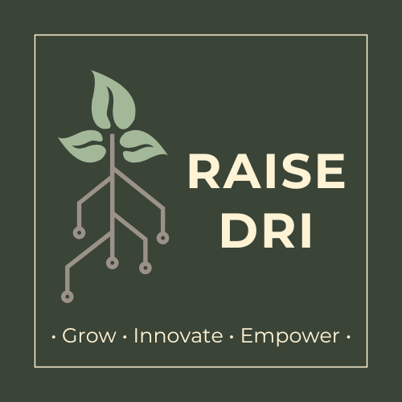

## Welcome

RAISE-DRI (Research and AI at Scale using Digital Research Infrastructure Resources) is an initiative supported by the Digital Research Alliance of Canada (the Alliance) through the DRI EDIA Champions Pilot Program. This project is committed to empowering equity-deserving researchers in Canada with the skills and knowledge needed to leverage the Digital Research Infrastructure (DRI) for scalable and impactful research.

RAISE-DRI offers virtual and in-person workshops and self-guided tutorials covering a range of topics in artificial intelligence, data science, and high-performance computing. These resources are designed to give researchers the knowledge and confidence to use the Alliance's DRI ecosystem in their work.

## Topics 

### [Digital Research Alliance of Canada (DRAC)]()
An overview of the **Digital Research Alliance of Canada** (the Alliance) and how it supports research innovations in Canada. 

### [Digital Research Infrastructure (DRI)]()
Learn about the Alliances's **Digital Research Infrastructure**, which provides Canadian reserchers with infrastructure for research data managment (RDM), advanced reseearch computing (ARC), and research software (RS). 

### [Intro to High-Performance Computing (HPC) and Advanced Research Computing (ARC)]()
Get familiar with high-performance computing (HPC) and the Advanced Research Computing Resources offered by the Digital Research Alliance of Canada. 

### [Intro to Data Science]()
A beginner's guide to Data Sceince, covering core concepts, tools, and methodologies. 

### [Intro to AI]()
Learn about the basics of AI, its applications, and how to get started using Python. 

### [Fundamentals of Machine Learning & Deep Learning]()
Explore the foundations of machine learning and deep learning, including neural networks. 

---

Feel free to explore and check back often for updates on each topic! 

