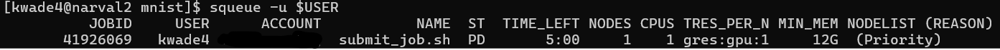
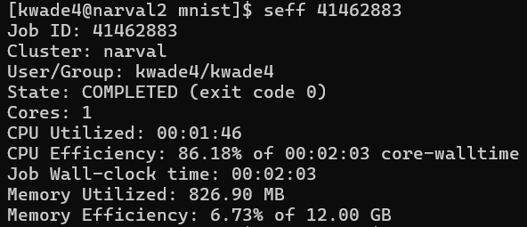
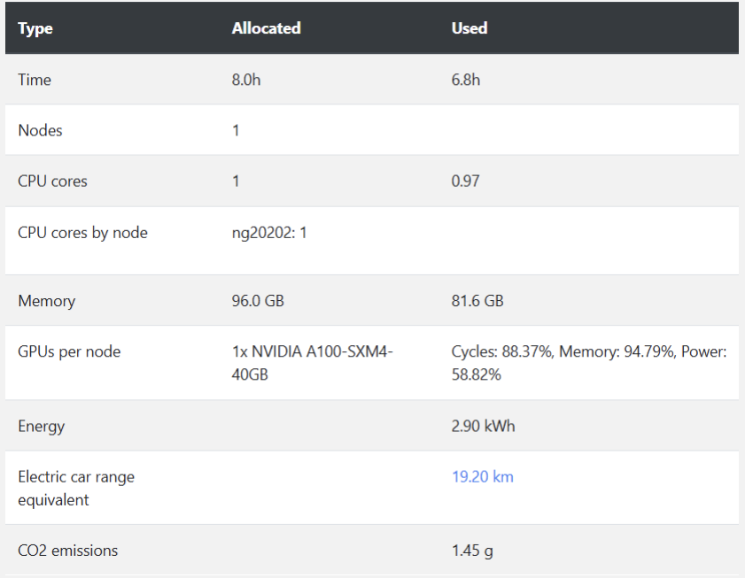
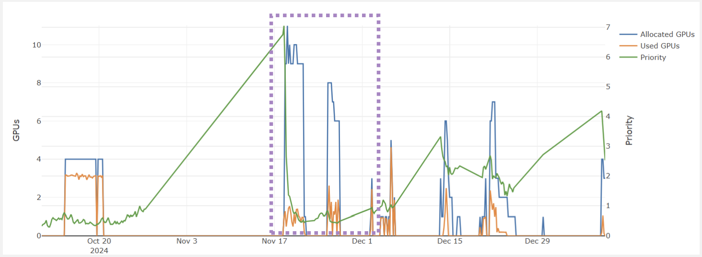

# Submitting Jobs on ARC Clusters 
{: .no_toc }

1. TOC
{:toc}

## Understanding Compute Resources on ARC Clusters 
When you first log into an ARC cluster, you are on a **login node**. However, login nodes are not meant for computations—they are for file management, job submission, and other lightweight tasks. To run computations, you need to submit a job to a **compute node** using a job script.

On ARC clusters, job scheduling is managed by **SLURM (Simple Linux Utility for Resource Management)**. SLURM schedules and allocates compute resources based on job requests.

## How SLURM Manages Jobs 
A SLURM job goes through four main stages:

1. **Job Submission**: A user submits a job using the `sbatch` command. SLURM then assigns a unique job ID (an 8-digit number). 

2. **Job Scheduling**: SLURM checks available resources and priority queues. Jobs are scheduled based on factors such as resource availability, priority, and fairness policies.

3. **Job Execution**: SLURM allocates the requested resources. The job runs on the assigned compute node(s).

4. **Completion & Monitoring**: Users can monitor their job status with `sq`. Output and error logs are saved in files named `slurm-<job ID>.out`.


## Example Job Script: `submit_job.sh`

Below is an example of a basic SLURM job script: 

```bash
#!/bin/bash
#SBATCH --account=my_account    # Account name
#SBATCH --job-name=my_job       # Name of the job
#SBATCH --ntasks=1              # Number of tasks
#SBATCH --mem=4G                # Memory allocation
#SBATCH --time=00:01:00         # Max runtime (HH:MM:SS)
#SBATCH --gpus=1                # Number of GPUs (if needed)

# Load required modules
module load python/3.10 cuda cudnn

# Set up a temporary virtual environment on the compute node
virtualenv --no-download $SLURM_TMPDIR/env
source $SLURM_TMPDIR/env/bin/activate

# Upgrade pip and install necessary packages using cluster-optimized wheels
pip install --no-index --upgrade pip
pip install --no-index tensorflow

# Run the Python script
python main.py
```

### Components of a Job Script 
1. **Shebang (`#!`)**  
    The **shebang** Specifies that this script should be executed using the Bash shell. 

2. **`#SBATCH` Directives**  
    `#SBATCH` directives are special directives used in SLURM job scripts to specify resource requests and job settings. These directives tell the SLURM scheduler how to allocate resources and manage the job. Each `#SBATCH` directive must be placed at the top of the script, before any executable commands: 
    ```console 
    #SBATCH --option=value
    ```  
      
    | **Directive**                  | **Description** |
    |--------------------------------|----------------|
    | `#SBATCH --account=my_account` | Specifies the account for computing resources. |
    | `#SBATCH --job-name=my_job`    | Assigns a custom name to the job for easy identification in `squeue`. |
    | `#SBATCH --ntasks=1`           | Defines the number of tasks (processes) to run. Used for parallel jobs. |
    | `#SBATCH --cpus-per-task=1`    | Requests 1 CPU core per task. Useful for multi-threaded applications. |
    | `#SBATCH --mem=4G`             | Requests 4 GB of RAM for the job. |
    | `#SBATCH --time=00:05:00`      | Sets the maximum runtime to 5 minutes (HH:MM:SS). Jobs exceeding this time are automatically terminated. |
    | `#SBATCH --gpus=1`             | Requests 1 GPU. |
    | `#SBATCH --output=job_output.txt` | Redirects standard output (`stdout`) to `job_output.txt`. |
    | `#SBATCH --error=job_error.txt`   | Redirects error messages (`stderr`) to `job_error.txt`. |


3. **Loading Required Software**
    ```console
    module load python/3.10 cuda cudnn
    ```
    * `module load`: Loads the necessary software for the job. 
    * `python/3.10` loads Python 3.10 
    * `cuda` and `cudnn` load GPU acceleration libraries for deep learning.   

4. **Creating a Virtual Environment** 
    ```console 
    virtualenv --no-download $SLURM_TMPDIR/env
    source $SLURM_TMPDIR/env/bin/activate
    ```

    These lines create a virtual environment in `$SLURM_TMPDIR`, which is a temporary storage directory on the compute node. Compute nodes have very fast read and write speeds, making `$SLURM_TMPDIR` faster than the `HOME` directory. 
    
    It is also a good idea to extract any data used in your script to `$SLURM_TMPDIR`.  

    ```console 
    tar -xf data.tar.gz -C $SLURM_TMPDIR/
    ```

    This command extracts files from the archive `data.tar.gz` to the `$SLURM_TMPDIR`.     

5. **Installing Packages**
    ```console
    pip install --no-index --upgrade pip
    pip install --no-index tensorflow
    ```

    These lines ensure package installations used pre-built wheels that are optimized for the ARC clusters. 
    * `pip install --no-index --upgrade pip`: Upgrades `pip` without accessing external repositories. 
    *  `pip install --no-index tensorflow`: Installs Tensorflow using pre- built cluster wheels.   

6. **Executing Scripts**
    ```console
    python main.py
    ```  

    This line runs the Python file `main.py`, which is in the working directory when the job starts. The script, [`main.py`](https://github.com/kwade4/RAISE-DRI/blob/main/workshop_examples/mnist/mnist/main.py), trains a  neural network to recognize handwritten digits using the MNIST dataset. 


## Submitting Jobs 
* Submit a job using `sbatch`:
    ```console
    sbatch <job_script.sh>
    ```
* Check job status with `sq` or `squeue`:
    ```console 
    sq
    ``` 

    or 

    ```console
    squeue -u $USER 
    ```
    `$USER` is an enviroment variable that represents *your* username.  

    `sq` and `squeue -u $USER` are equivalent commands.

     
    
    * `JOBID`: is the unique 8-digit identifier assigned to the job.
    * `USER`: represents the CCDB username. 
    * `ACCOUNT`: is the account name, which is assoicated with a PI. 
    * `NAME`: is the name of the job. But default it will be the name of the job script. 
    * `ST`: the **state** of the job (e.g., `PD` for pending and `R` for running). 
    * `TIME_LEFT`: is the amount of time remaining before the job reaches its allocated time (`--time`). 
    * `NODES`: is the number of `compute nodes` requested in the job script. 
    *  `CPUS`: is the number of CPU cores requested in the job script. 
    * `TRES_PER_N`: is the allocated trackable resources (TRES) per node, such as GPUs or memory. 
    * `MIN_MEM`: the minimum amount of memory requested per node. 
    * `NODELIST (REASON)`: the compute nodes assigned to the job, or if the job is pending, the reason why (e.g., waiting for resources, priority, dependency).   

* View job logs (once completed) using: 
    ```console
    cat slurm-<job_id>.out
    ```

* Check job efficiency using: 
    ```console
    seff <job-ID>
    ```
     

    This output can help you in figuring out how much time amd computing resources your job needs. 

## Monitoring Jobs 
ARC clusters such as `narval` have [**user portals**](https://portail.narval.calculquebec.ca/), which offer a visual interface for viewing job statistics. To view usage information, go to **Account>Job Stats**



You can also view energy consumption and carbon emissions associated with each job. 

The **user portal** also allows you to monitor your group's priority. 



The purple box in the graph above shows the group's priority (shown in green), which is relatively high. However, When many resources  are allocated (represented by the blue line), the priority sharply decreases. This drop is intentional to ensure that other groups have the opportunity to access their fair share of resources. The orange line represents the actual resources used, which is much lower than what was allocated. Had this group been more responsible in their resource allocation, the priorty would not have decreaed as dramatically.  


## Tips, Tricks, and Best Practices 

Choosing the right amount of CPU, memory, and runtime for your jobs can involve trial and error, especially when running a job for the first time. Below are some best practices to improve efficiency and minimize queue times:

⚠️ **DO NOT Run Computations on Login Nodes**
* Always use `sbatch` to submit jobs to compute nodes.
* The login nodes are meant for storing code files, small parameter files, and job scripts only.

✅ **Request Only the Resources You Need**
* Requesting too many resources can increase queue time, while requesting too few can lead to job failures and can reduce the paralellization.
* Start with a reasonable estimate and adjust based on job performance.
* Jobs with shorter time limits and fewer resource requests often start sooner because they can fit into scheduling gaps.

🔄 **Test with Small Jobs First**
* Before running large-scale jobs, test with a small dataset and shorter runtime to ensure your script works correctly.
* Some clusters, like `narval`, offer multi-instance GPUs, which allow a single GPU to be divided into multiple partial units. This can help reduce wait times during testing. 
    * Example: `--gres=gpu:a100_1g.5gb:1`:  specifies using 1 NVIDIA A100 GPU with 5GB of memory.

🛠 **Add Checkpoints to Your Code**
* Checkpoints allow your job to restart where it left off in case it gets interrupted, preventing the need to start over from scratch. This is especially helpful for long-running jobs or jobs on shared resources.
* Checkpoints are also useful for debugging, as they allow you to inspect the state of your job at various stages of its executio

💾 **Optimize I/O Operations**
* Reading and writing many small files to the disk can be slow and inefficient. Minimize I/O operations where possible.
* Compress large datasets into `ZIP` or `TAR` files. 
* When working with large datasets, extract them into `$SLURM_TMPDIR/` (the temporary directory on the compute node). 
    * `$SLURM_TMPDIR` offers fast, local storage and prevents bottlenecks associated with shared disk access.

📊 **Monitor & Adjust Resource Usage**
* Check job usage with `seff <job_id>` or the **user portal** to see if your job underutilized or exceeded requested resources.

📧 **Set Up Email Notifications**
* You can receive email notifciations about the status of your job. 
* Add these lines to your job script to receive notifications when your job starts, ends, or if it fails: 

    ```console
    #SBATCH --mail-user=<user@email.com>  
    #SBATCH --mail-type=ALL                
    ```


