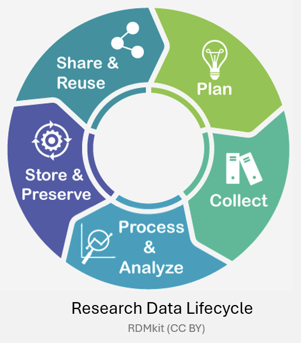
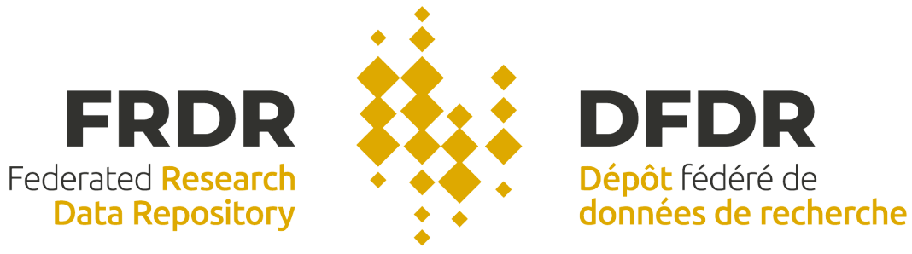
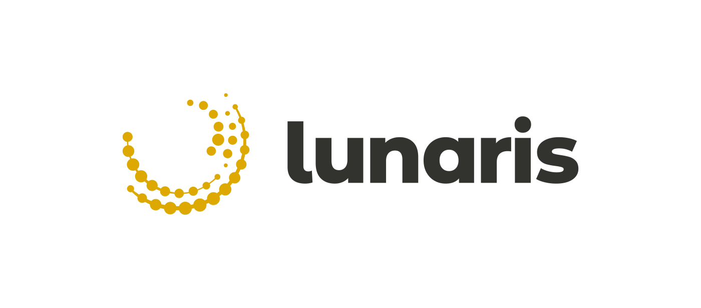
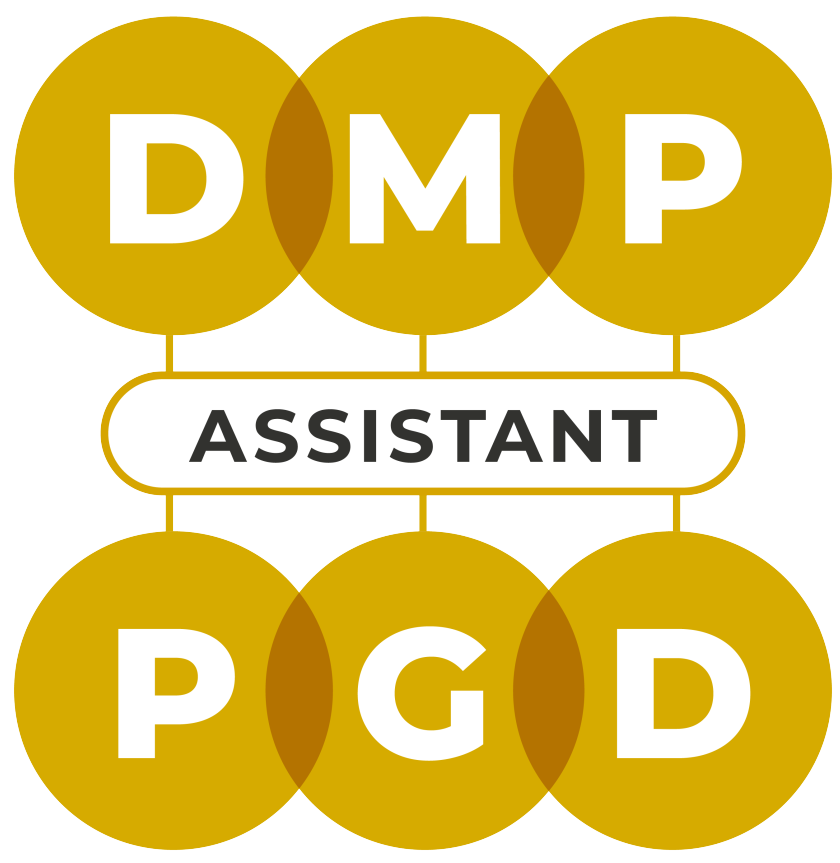

# Research Data Management (RDM)

## What is RDM?
Research Data Management (RDM) is essential for guiding the entire research lifecycle. From its initial creation to its eventual sharing and long-term preservation, RDM ensures that data is effectively organized, stored, and maintained throughout the research process. It enables researchers to access and use data efficiently, improves the quality of research, and helps drive scientific discovery.

## The Research Data Lifecycle 
The research data lifecycle outlines the stages of data management from the moment data is created to its ultimate sharing and preservation. The main stages of the research data lifecycle are:

1. **Data Planning**: Planning includes outlining how data will be collected, stored, shared, and preserved. It ensures that best practices for data management are incorporated from the outset.

2. **Data Collection**: This phase involves gathering data through experiments, observations, or simulations. RDM ensures that data is organized and documented properly during collection for easy access later.

3. **Data Processing and Analysis**: Once data is collected, it must be processed and analyzed. RDM practices ensure that the data is processed securely, and any changes to the data are well-documented to maintain integrity.

4. **Data Storage and Preservation**: RDM ensures that data is stored safely, with appropriate backups and security measures. Data preservation ensures that data remains accessible and usable over time. Long-term storage strategies and metadata management are key to ensuring data’s continued value and usability.

5. **Data Sharing and Reuse**: Sharing research data allows researchers to make their findings publicly available, enabling other researchers to validate, build upon, or reuse the data.

## Importance of RDM 

Effective RDM is not just a technical requirement, but also a professional and ethical obligation for researchers. It ensures that data is shared in ways that are transparent, accessible, and beneficial to the broader community. Proper RDM practices enhance scientific discovery by ensuring that data is of high quality, well-documented, and easy to find.

RDM also supports the broader goals of open science by encouraging collaboration across disciplines and making research more reproducible and reliable. By organizing and making data available to the community, RDM increases the impact and value of research and can benefit the global scientific community as whole.

## FAIR and FAIRER Principles
The FAIR principles: **Findable**, **Accessible**, **Interoperable**, and **Reusable**, are the cornerstone of effective RDM. These principles guide the organization, sharing, and reuse of research data, and ensures that it can be easily discovered, accessed, and applied by other researchers.

The FAIRER principles build on these foundational concepts and emphasize **ethics** and **reproducibility**. Ethical data management ensures that research data is shared responsibly and with respect for the rights and privacy of individuals. Reproducibility ensures that data can be verified and reused to replicate results, which is essential for maintaining scientific integrity.

🔍 **Findable**: Data should have identifiers and metadata to make it discoverable.  
🔓 **Accessible**: Data should be available for use by the community.  
⚙️ **Interoperable**: Data must comply with standards and formats (.csv, .pdf).   
♻️ **Reusable**: Data must be described and licensed to allow others to reuse it.  
⚖️ **Ethical**: Data must comply with ethical guidelines.  
📊 **Reproducible**: Research findings and workflows can be replicated by others. 

## RDM Support Offered by the Alliance

### 🗃️ Federated Research Data Repository 
The [Federated Research Data Repository (FRDR)](https://www.frdr-dfdr.ca/repo/) is a bilingual, national platform designed to support Canadian researchers in storing, sharing, and preserving their data. It provides a secure and robust option for researchers to deposit, curate, and share large datasets. 

FRDR provides services to help researchers store and manage their data, preserve their ressearch, and comply with journal and funding agency data sharing requirements. Services include 1TB of default storage, DOIs for identification and citation, integration with ORCID profiles, and many more. The platform also supports embargoes, regular backups, and internal review for optimizing the FAIRness of data. Additionally, FRDR provides collaboration tools, selective sharing, and data indexing to make datasets discoevrable in Lunaris, Google Dataset Search, OpenAIRE, and many more. 

 
### 🔍 Lunaris
[Lunaris](https://www.lunaris.ca/) is a bilingual, scalable service offered by the Digital Research Alliance of Canada that enables researchers to discover multidisciplinary research data from across Canada. It provides a centralized search platform for datasets housed in a variety of repositories, including those from universities, government departments, and national research initiatives. With over 80,000 datasets indexed from more than 100 Canadian repositories, Lunaris makes data easily accessible for discovery. Additionally, Lunaris metadata is harvested by discovery platforms like OpenAIRE, Data Citation Index, and ProQuest Central Discovery Index.

### 📝 DMP Assistant
The [DMP Assistant](https://dmp-pgd.ca/) is an online, bilingual tool developed by the Digital Research Alliance of Canada in collaboration with the University of Alberta. It helps researchers create Data Management Plans (DMPs), which outline how research data will be managed throughout a project’s lifecycle. The DMP Assistant is prompt-based, freely accessible, and offers best-practice guidelines and examples that comply with RDM principles and Canadian Tri-Agency policies.  
 

  

### 🌌 Borealis
[Borealis](https://borealisdata.ca/), the Canadian Dataverse Repository, is a secure, bilingual platform for managing, sharing, and preserving Canadian research data. Hosted by Scholars Portal and the University of Toronto Libraries, Borealis is supported by academic libraries, research institutions, and the Alliance. 

Borealis is available to researchers affiliated with participating Canadian institutions and offers support for data deposit, publishing, and discovery. Key features include automatic DOI generation, customizable license options, restricted access, version tracking, and preservation support with monthly integrity checks.

Borealis faciliates data discovery and collaboration with user-friendly tools like advanced search, data exploration tools, and customizable collection landing pages. 

### 🤝 Network of Experts 
The [Network of Experts](https://alliancecan.ca/en/services/research-data-management/network-experts) connects researchers with RDM specialists, including librarians, data management professionals, institutional research officers, ethics officers, and members from government and non-governmental organizations across Canada. These experts provide resources, guidance, and support in areas such as data curation, planning, repositories, discovery, metadata, training, preservation, and managing sensitive data.

### 📚 Training Resources 
The Alliance provides comprehensive training resources to help researchers with data management, planning, access, preservation, and discovery: 
* [Glossaries](https://alliancecan.ca/en/services/research-data-management/learning-and-training/glossaries)
* [Training Resources](https://alliancecan.ca/en/services/research-data-management/learning-and-training/training-resources) 
* [Institutional Contacts](https://alliancecan.ca/en/services/research-data-management/learning-and-training/institutional-contacts) 
* [More Resources](https://zenodo.org/communities/alliancecan/records) 
