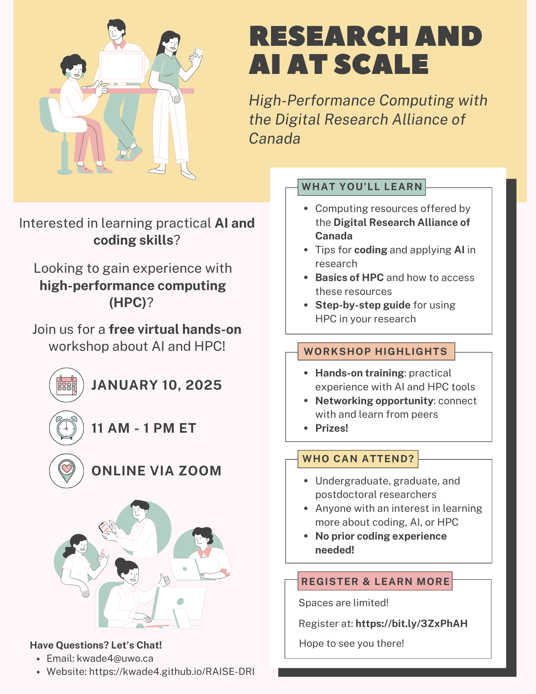

# Workshops Archives 

## Understanding the Peer Review Process: The Role of PREreview and Preprints 
<iframe src="{{ site.baseurl }}/assets/UnderstandingPeerReview.pdf" width="100%" height="600px"></iframe>

## Research and AI at Scale - Part 1
Presented on January 9th and January 10th, 2025
<iframe src="{{ site.baseurl }}/assets/Research_and_AI_at_Scale.pdf" width="100%" height="600px"></iframe>

## Research and AI at Scale - Part 2 
Presented on March 19th and March 20th, 2025 
<iframe src="{{ site.baseurl }}/assets/Research-and-AI-at-Scale-part2.pdf" width="100%" height="600px"></iframe>

# Past Events    

## Research and AI at Scale - Part 2 (Virtual)

## Research and AI at Scale - Part 2 (In-person)

## Research and AI at Scale - Part 1 (Virtual)

## Research and AI at Scale - Part 1 (In-person)

